# Readme of my homework : Deploy a fastapi application with postrgres with helm on k3d cluster

This document explains every steps of my homework : dm-ds-cdo-may24-jenkins 

---
## Prerequisites
###  P-0) Execute these commands to initiate environment
#### P-0.1) P-0.1) Write a ./docker-compose.yml file to build a docker image jenkins server
```md

cd /home/cpa/Documents/CPA/44_JENKINS/DM.JENKINS/DM-SP04-C04-JENKINS-CPA-MAY2024/dm-ds-cdo-may24-jenkins

vim docker-compose.yml

```

You can access to this script : [`docker-compose.yml`](./docker-compose.yml)
####  P-0.2) Write a shell script ./init-k3d.sh to install the work environment 
```md

cd /home/cpa/Documents/CPA/44_JENKINS/DM.JENKINS/DM-SP04-C04-JENKINS-CPA-MAY2024/dm-ds-cdo-may24-jenkins

vim init-k3d.sh

```
You can access to this script : [`init-k3d.sh`](./init-k3d.sh)
<br>
<br>

####  P-0.2)  Execute these commands to initiate environment 
```md
./init-k3d.sh
sudo kubectl get all -A -o wide
```
<br>
<br>

####  P-0.3)  Screenshot of terminal 
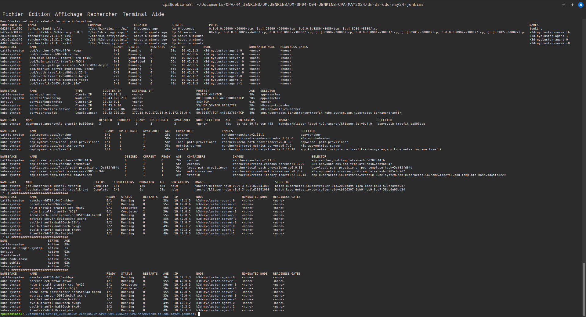
<br>
<br>

### P-1) The folow softwares must be installed on the  local machine:  
1. git
2. docker and his plugin docker compose
3. k3d
4. helm  
<br>

### P-2) Verify all these softwares are well installed
```md
sudo git version 

sudo docker version
sudo docker compose version 
which docker
sudo systemctl status docker

sudo k3d version 

sudo helm version
```
<br>

### P-3) Move to work directory
```md
cd /home/cpa/Documents/CPA/44_JENKINS/DM.JENKINS/DM-SP04-C04-JENKINS-CPA-MAY2024/dm-ds-cdo-may24-jenkins
```
<br>

### P-4) Synchronize Github repo with local directoy of project
```md
ssh-add ../.ssh/ssh-key-github-cpa8876
git branch -a
git status
git add .
git commit -m "update file ./Docker-composez.yaml to delete blank rom on volume bloc"
git push origin main
```
<br>

### P-5) Create the docker "network create dm-jenkins-cpa-infra_my-net"

```md

sudo docker network ls
sudo docker network create dm-jenkins-cpa-infra_my-net
sudo docker network ls

```
<br>

### P-6) Build container docker of jenkins server 
#### P-6.1) Writez a docker-compose file to create a container docker for the jenkins server
You can access to this script : [`docker-compose.yml`](./docker-compose.yml)


```md
sudo docker ps -a
sudo docker compose down
sudo docker compose up -d
sudo docker ps -a
```
<br>

### P-7) Log on  jenkins server 
Log on  [192.168.20.1:8280](192.168.20.1:8280) in firefox private mode

<br>
<br>
Log on [http://192.168.20.1:8280/](http://192.168.20.1:8280/)
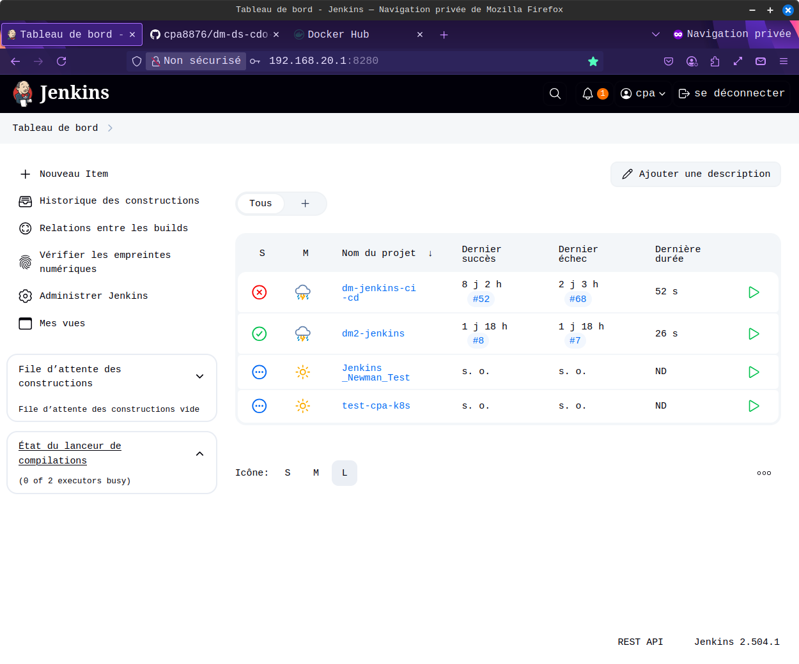
<br>

### P-8) Log on Github repo of jenkins homework  
Log on [https://github.com/cpa8876/dm-ds-cdo-may24-jenkins#](https://github.com/cpa8876/dm-ds-cdo-may24-jenkins#) 
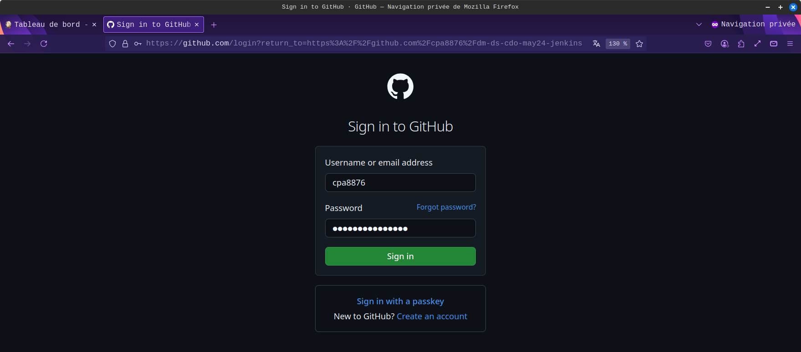
<br>
<br>
Log on [https://github.com/cpa8876/dm-ds-cdo-may24-jenkins](https://github.com/cpa8876/dm-ds-cdo-may24-jenkins)
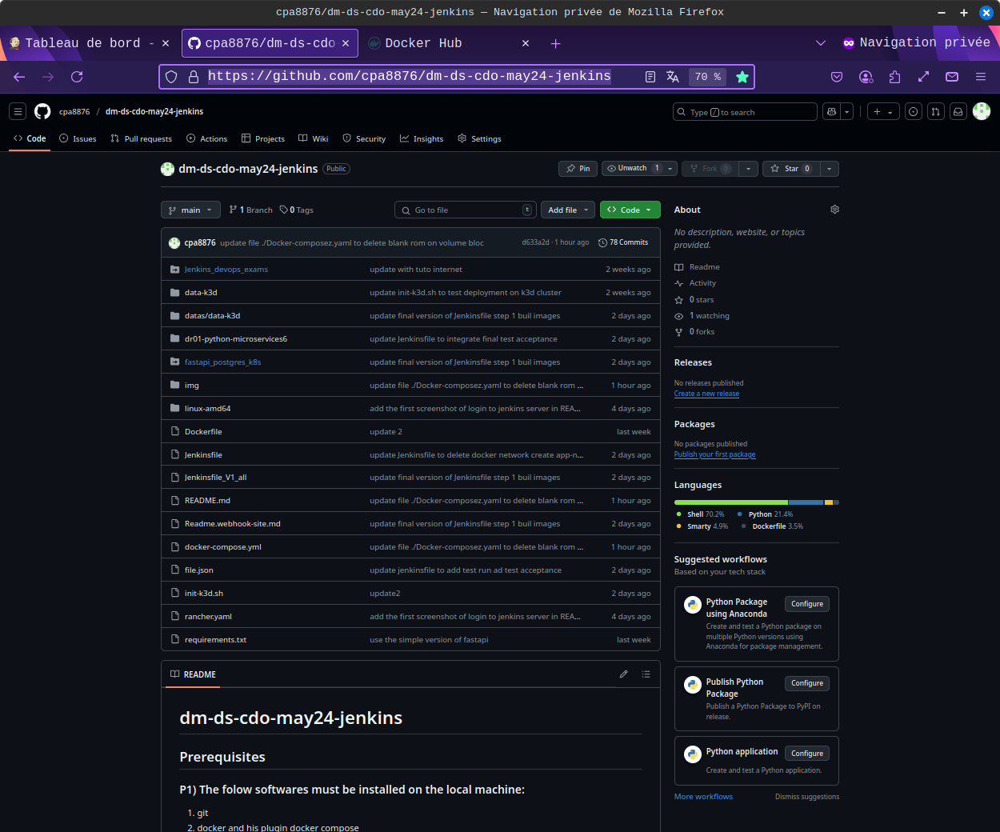
<br>

### P-9) Log on Dockerhub repo of jenkins homework  
Log on [Dockerhub](https://hub.docker.com/repositories/dmcpa8876)

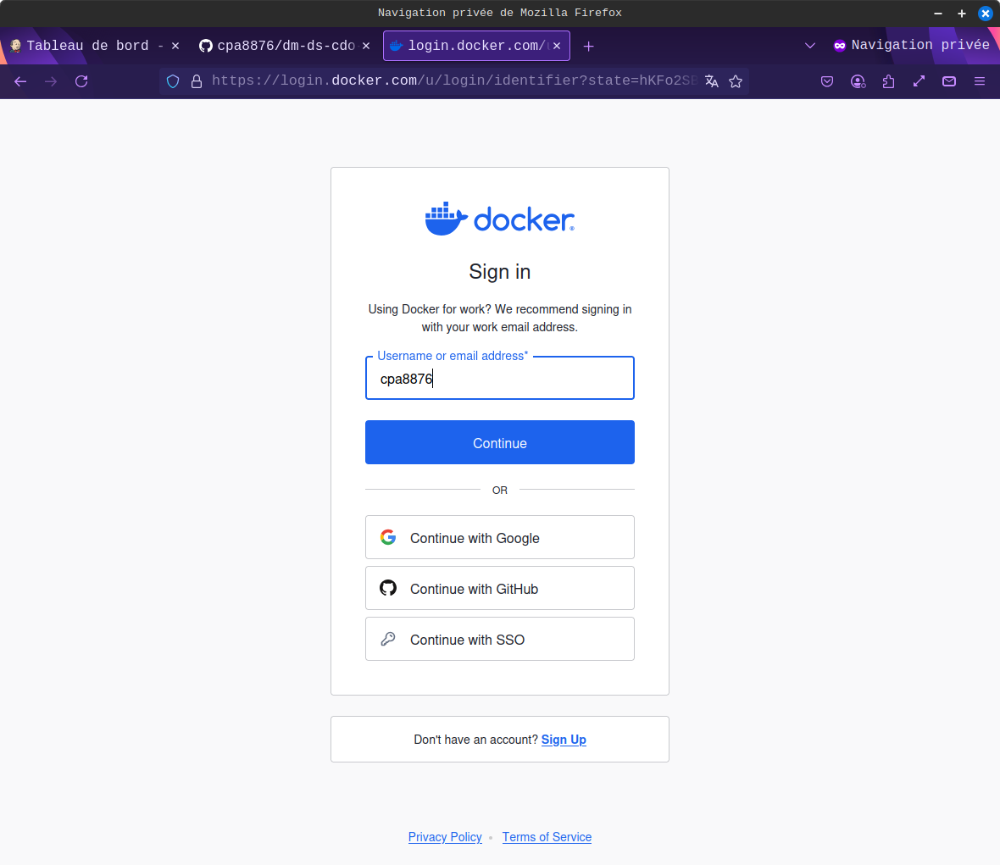
<br>
<br>
Log on [https://hub.docker.com/repositories/cpa8876](https://hub.docker.com/repositories/cpa8876)
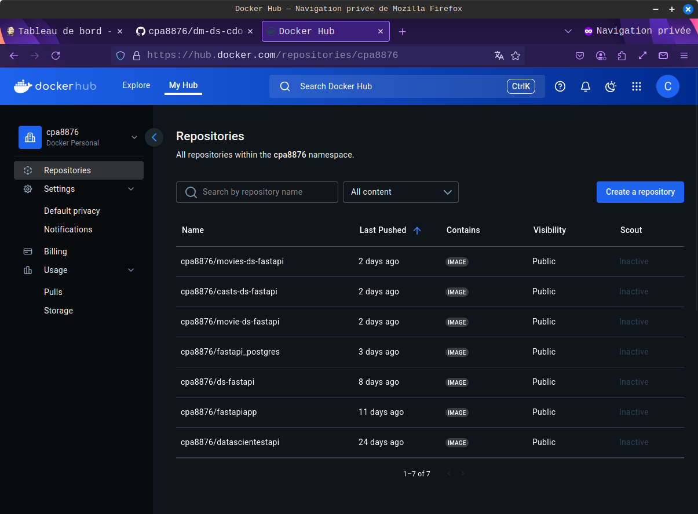
<br>
<br>
<br>
---

## Step 1)  Create a directory for the homework
```md
mkdir -p DM-SP04-C04-JENKINS-CPA-MAY2024
cd   ./DM-SP04-C04-JENKINS-CPA-MAY2024
```
<br>
## Step 2) Create Dockerhub account
### S-2.1) Create a repository Docker hub : "cpa8876"

### S-2.2) Create this docker images
#### S-2.2.1)  docker image for the application fastapi to manage movies :
`sudo docker push cpa8876/movies-dm-ds-jenkins-fastapi:tagname`

#### S-2.2.2)  docker image for th database useb by movies-dm-ds-jenkins-fastap:
`sudo docker push cpa8876/db-movies-dm-ds-jenkins-fastapi:tagname`

#### S-2.2.3)  application fastapi to manage casts :
`sudo docker push cpa8876/casts-dm-ds-jenkins-fastapi:tagname`

#### S-2.2.2)  docker image for the database useb by casts-dm-ds-jenkins-fastapi:
```md 
sudo docker push cpa8876/db-casts-dm-ds-jenkins-fastapi:tagname
docker push dmcpa8876/dm-jenkins-cpa8876-fastapi:tagname \
https://hub.docker.com/repositories/dmcpa8876
```

<br>
## Step 3) Create Github account and a repository for homework
### S-3.1) Url  repo github of homework  [github cpa8876 for jenkins homework]( https://github.com/cpa8876/) 
  
### S-3.2) Url to clone this repo  : 
`git clone https://github.com/cpa8876/dm-ds-cdo-may24-jenkins.git`

### S-3.3) Generate with sshgen and save a pair of ssh keys to connect to the Github account 
Url where is saved  this keypair ssh access github repo:  ./.ssh/ssh-key-github-cpa8876 and ssh-key-github-cpa8876.pub`

<br>
## Step 4) Clone repo github jenkins datascientest homeworks
### S-4.1) the fisrt time :

#### S-4.1.1) Clone the repository github datascientest included files for the jenkins homework.
```md
git clone https://github.com/DataScientest/Jenkins_devops_exams.git
git status
git branch -a
```
#### S-4.1.2) Clone the dm jenkins Github repo to my PC
```md
cd ~/Documents/CPA/44_JENKINS/DM.JENKINS/DM-SP04-C04-JENKINS-CPA-MAY2024/dm-ds-cdo-may24-jenkins
ssh -add ../.ssh/ssh-key-github-cpa8876
  
git clone https://github.com/cpa8876/dm-ds-cdo-may24-jenkins.git
  
ls -lha
=> total  20K
drwxr-xr-x  5 cpa cpa 4,0K 24 avril 16:05 .
drwxr-xr-x 16 cpa cpa 4,0K 24 avril 16:04 ..
drwxr-xr-x  7 cpa cpa 4,0K 24 avril 16:06 dm-ds-cdo-may24-jenkins
drwxr-xr-x  6 cpa cpa 4,0K 15 avril 23:24 Jenkins_devops_exams
drwxr-xr-x  5 cpa cpa 4,0K 25 mars  22:00 .ssh
```

#### S-4.1.3) Create the first version of README.md to test Github cpa8876/dm-ds-cdo-may24-jenkins
```md
git  status
git  add README.md
git commit -m "Create README to explain architecture of my homework Jenkins version  1

git push origin main
```

### S-4.2) Connect to github personal repository for the homework the second time and after
```md
cd ~/Documents/CPA/44_JENKINS/DM.JENKINS/DM-SP04-C04-JENKINS-CPA-MAY2024/dm-ds-cdo-may24-jenkins
ssh-add ../.ssh/ssh-key-github-cpa8876
git status
git branch -a
```
<br>

##  Step 5)  Delete all docker containers and images 
 
#### S-5.1)  List all  dockers volumes, networks, images, and containers.
```md
sudo docker network ls
sudo docker volume ls
sudo docker image ls -a 
sudo docker ps -a
```
<br>
### S-5.2)  Delete all  containers, images, volumes and  networks. .
```md
sudo docker rm -f $(sudo docker ps -aq)
sudo docker image rmi -f $(sudo docker image ls  -q)
sudo docker volume rm -f $(sudo docker volume ls -q)
sudo docker network rm  $(sudo docker network ls -q)
```
<br>

### S-5.3)  Verify the deletion of  all  dockers networks, volumes,  images and containers.
```md
sudo docker network ls
sudo docker volume ls
sudo docker image ls -a
sudo docker ps -a
```
<br>


## Step 6)  Create a script shell file "init-k3d.sh" to create my infrastructure  
This script create an infrastructuture with:  
- one server jenkins,  
- one loadbalancer to access to a cluster k3d  composed by :  
&nbsp; &nbsp; - one control master  
&nbsp; &nbsp; - and    two workers  
<br>

### S-6.1)  Create a container Docker for jenkins with a Docker-compose.yml
```md
vim /home/cpa/Documents/CPA/44_JENKINS/DM.JENKINS/DM-SP04-C04-JENKINS-CPA-MAY2024/dm-ds-cdo-may24-jenkins/docker-compose.yml

```
#### S-6.2) : Create a script shell « init-k3d.sh » to build all architecture and execute sudo docker compose up -d command

#### S-6.3) : Execute script shell « init-k3d.sh » to build all architecture and execute sudo docker compose up -d command
```md
cpa@debiana8:~/Documents/CPA/44_JENKINS/DM.JENKINS/DM-SP04-C04-JENKINS-CPA-MAY2024/dm-ds-cdo-may24-jenkins$ sudo docker ps -a
CONTAINER ID   IMAGE                            COMMAND                  CREATED         STATUS         PORTS                                                                                                                                                                          NAMES
6d9355f287d7   jenkins/jenkins:lts              "/usr/bin/tini -- /u…"   2 minutes ago   Up 2 minutes   0.0.0.0:50000->50000/tcp, [::]:50000->50000/tcp, 0.0.0.0:8280->8080/tcp, [::]:8280->8080/tcp                                                                                   jenkins
a529bb43b3c1   ghcr.io/k3d-io/k3d-proxy:5.8.3   "/bin/sh -c nginx-pr…"   3 minutes ago   Up 3 minutes   80/tcp, 0.0.0.0:34389->6443/tcp, 0.0.0.0:8900->30080/tcp, [::]:8900->30080/tcp, 0.0.0.0:8901->30081/tcp, [::]:8901->30081/tcp, 0.0.0.0:8902->30082/tcp, [::]:8902->30082/tcp   k3d-mycluster-serverlb
27c924c01aef   rancher/k3s:v1.31.5-k3s1         "/bin/k3d-entrypoint…"   3 minutes ago   Up 3 minutes                                                                                                                                                                                  k3d-mycluster-agent-1
2b0ad4c23daf   rancher/k3s:v1.31.5-k3s1         "/bin/k3d-entrypoint…"   3 minutes ago   Up 3 minutes                                                                                                                                                                                  k3d-mycluster-agent-0
c8f9641dcd22   rancher/k3s:v1.31.5-k3s1         "/bin/k3d-entrypoint…"   3 minutes ago   Up 3 minutes                                                                                                                                                                                  k3d-mycluster-server-0
cpa@debiana8:~/Documents/CPA/44_JENKINS/DM.JENKINS/DM-SP04-C04-JENKINS-CPA-MAY2024/dm-ds-cdo-may24-jenkins$ sudo kubectl get all -n dev
No resources found in dev namespace.
cpa@debiana8:~/Documents/CPA/44_JENKINS/DM.JENKINS/DM-SP04-C04-JENKINS-CPA-MAY2024/dm-ds-cdo-may24-jenkins$ sudo kubectl get nodes
NAME                     STATUS   ROLES                  AGE     VERSION
k3d-mycluster-agent-0    Ready    <none>                 3m58s   v1.31.5+k3s1
k3d-mycluster-agent-1    Ready    <none>                 3m58s   v1.31.5+k3s1
k3d-mycluster-server-0   Ready    control-plane,master   4m7s    v1.31.5+k3s1
```
<br>
## Step 7)  Connect with firefox on the jenkins server http://192.168.20.1:8280

### S-7.1) Access on jenkins server
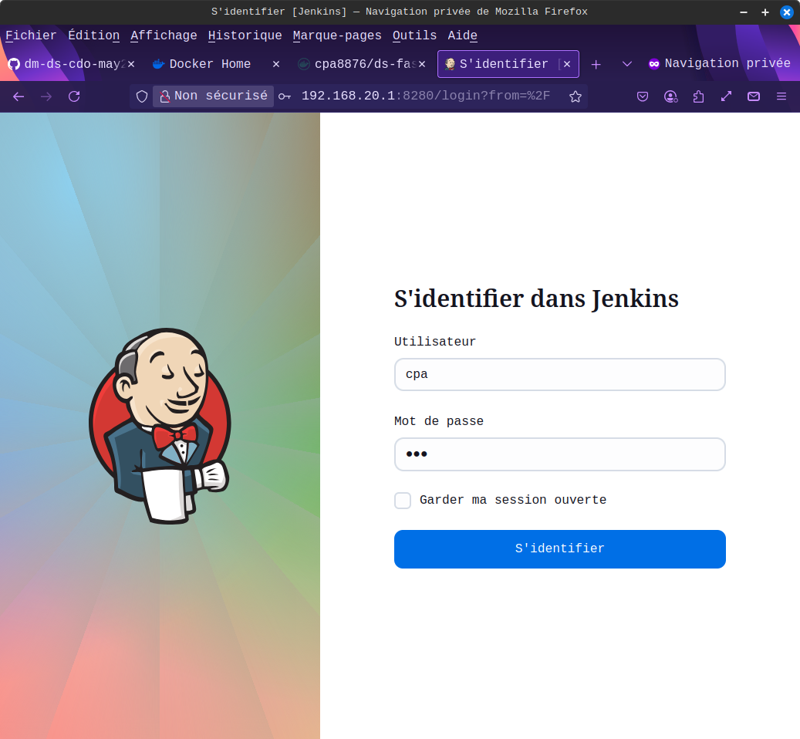
<br>

### S-7.2) Install plugins
1. plugins suggered on initialisation of jenkins server
2. Github integration
3. Pipeline stage view
4.  Email Extension Plugin Version 1876.v28d8d38315b_d 
<br>


### S-7.3) Install pluginsScreenshots of installed plugins
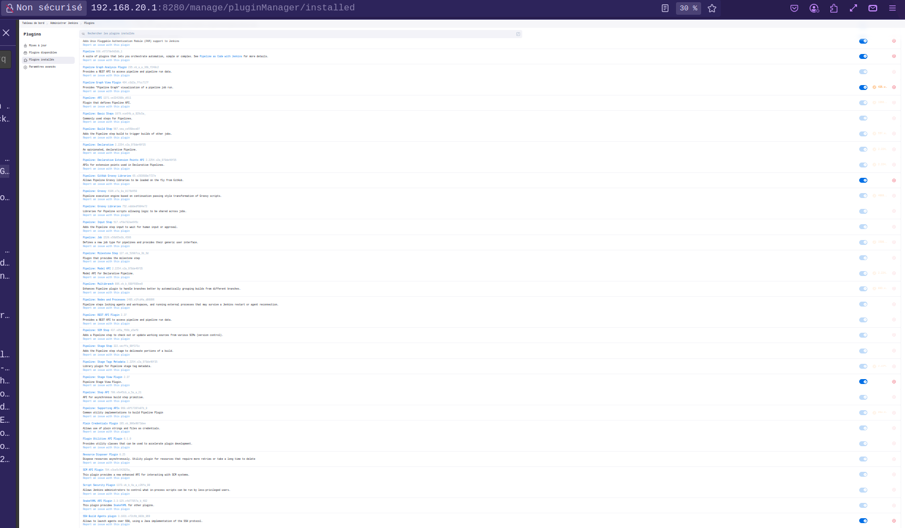
<br>


### S-7.4) Create a Jenkins API token
Create a Jenkins API token
First, we going to generate a Jenkins API token which will be used by the webhook to communicate with the Jenkins build job.
Go to Jenkins home page > Click on your name > Configure > Add new token
Give the new token a name and remember to copy and save the API token.

http://192.168.20.1:8280/job/dm-jenkins-ci-cd/configure
Jeton d'authentification:  wh-cpa8876
<br>


### S-7.5) Configure personnal access token access to dockerhub  in secret variable system on jenkins  
https://app.docker.com/settings/personal-access-tokens 
Access token description
DAT
Expires on
Never
Access permissions
Read, Write, Delete
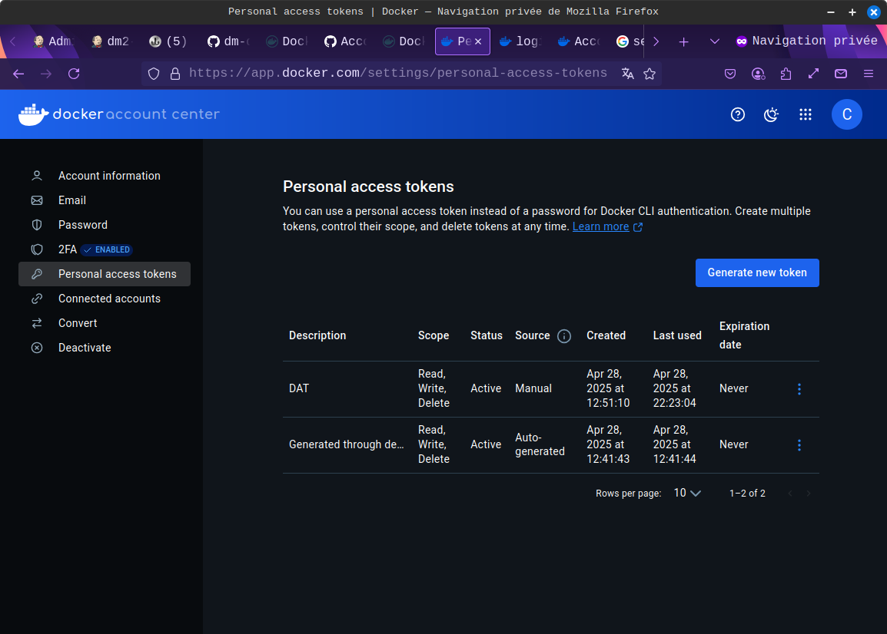
<br>

### S-7.6) Configure the token dockerhub in secret variable system on jenkins

http://192.168.20.1:8280/manage/credentials/store/system/domain/_/newCredentials
Type : Secret text
Portée Global (Jenkins, agent, items,etc…)
Secret : 
id : token_dockerhub
Description : token_dockerhub for the dm Jenkins
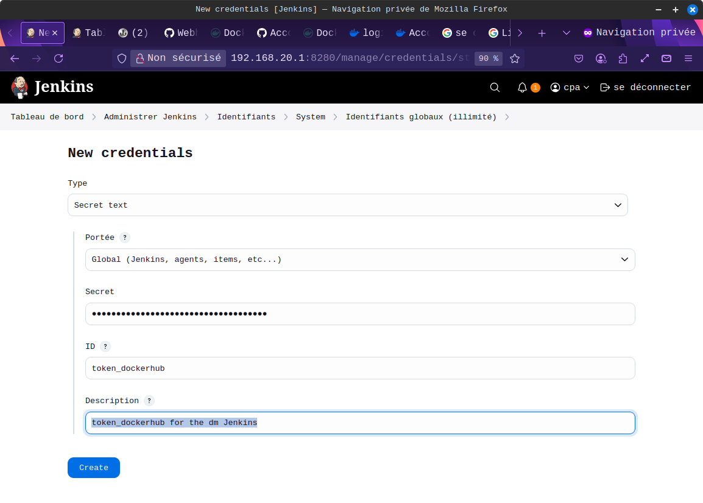
<br>
<br>

## Step 8 : Create a docker for the server jenkins and a specific network. 

### S-8.1) Create a docker network "dm-jenkins-cpa-infra_my-net", that will be used by the containers of "jenkins" server and the cluster k3d composed with a control master and 2 worker and a loadbalancer
```md
sudo docker network rm d dm-jenkins-cpa-infra_my-net
sudo docker network create dm-jenkins-cpa-infra_my-net
 sudo docker network ls
```
<br>

### S-8.2) Create the docker infrastructure composed by a server jenkins, a cluster k3d composed one loadbalancer server, a control master and 2 workers
```md
sudo docker compose down
sudo docker compose up -d
```
<br>


#### S-8.2.1) List  the docker  containers, images, volumes and networks.
```md
sudo docker ps -a
sudo docker image ls -a
sudo docker volume ls 
sudo docker network ls 
```

#### S-8.2.1)  Connect on the container docker jenkins and verify docker commands.
```md
 sudo docker exec -it jenkins bash

 docker ps -a
docker image ls -a
docker volume ls 
docker network ls 

 ls -lha /app/
exit
```
<br>
<br>

## Step 9)  Test docker compose fastapi applications with ./dr01-python-microservices6/docker-compose .yaml
#### S-9.1) Execute : « docker compose up -d » from /dr01-python-microservices6/
```md
cd dr01-python-microservices6/
sudo docker compose up -d
```
<br>

### S-9.2)  Test movies api from 192.168.20.1:8001
- Test curl 
```md
 curl http://192.168.20.1:8001/api/v1/movies/docs 

    <!DOCTYPE html>
    <html>
    <head>
    <link type="text/css" rel="stylesheet" href="https://cdn.jsdelivr.net/npm/swagger-ui-dist@3/swagger-ui.css">
    <link rel="shortcut icon" href="https://fastapi.tiangolo.com/img/favicon.png">
    <title>FastAPI - Swagger UI</title>
    </head>
    <body>
    <div id="swagger-ui">
    </div>
    <script src="https://cdn.jsdelivr.net/npm/swagger-ui-dist@3/swagger-ui-bundle.js"></script>
    <!-- `SwaggerUIBundle` is now available on the page -->
    <script>
    const ui = SwaggerUIBundle({
        url: '/api/v1/movies/openapi.json',
    oauth2RedirectUrl: window.location.origin + '/docs/oauth2-redirect',
        dom_id: '#swagger-ui',
        presets: [
        SwaggerUIBundle.presets.apis,
        SwaggerUIBundle.SwaggerUIStandalonePreset
        ],
        layout: "BaseLayout",
        deepLinking: true
    })
    </script>
    </body>
    </html>
```
<br>

- Screenshot from firefox
http://192.168.20.1:8001/api/v1/movies/docs 
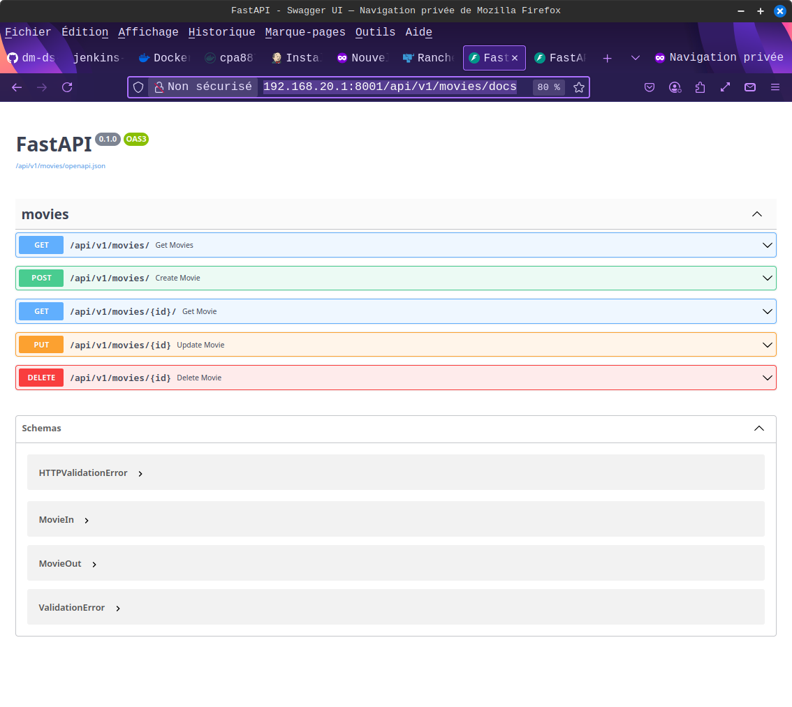
<br>


### S-9.3)  Test movies api from 192.168.20.1:8080
- Test curl 
```md
curl http://192.168.20.1:8080/api/v1/movies/docs

    <!DOCTYPE html>
    <html>
    <head>
    <link type="text/css" rel="stylesheet" href="https://cdn.jsdelivr.net/npm/swagger-ui-dist@3/swagger-ui.css">
    <link rel="shortcut icon" href="https://fastapi.tiangolo.com/img/favicon.png">
    <title>FastAPI - Swagger UI</title>
    </head>
    <body>
    <div id="swagger-ui">
    </div>
    <script src="https://cdn.jsdelivr.net/npm/swagger-ui-dist@3/swagger-ui-bundle.js"></script>
    <!-- `SwaggerUIBundle` is now available on the page -->
    <script>
    const ui = SwaggerUIBundle({
        url: '/api/v1/movies/openapi.json',
    oauth2RedirectUrl: window.location.origin + '/docs/oauth2-redirect',
        dom_id: '#swagger-ui',
        presets: [
        SwaggerUIBundle.presets.apis,
        SwaggerUIBundle.SwaggerUIStandalonePreset
        ],
        layout: "BaseLayout",
        deepLinking: true
    })
    </script>
    </body>
    </html>
```
<br>


- Screenshot from firefox
http://192.168.20.1:8080/api/v1/movies/docs 
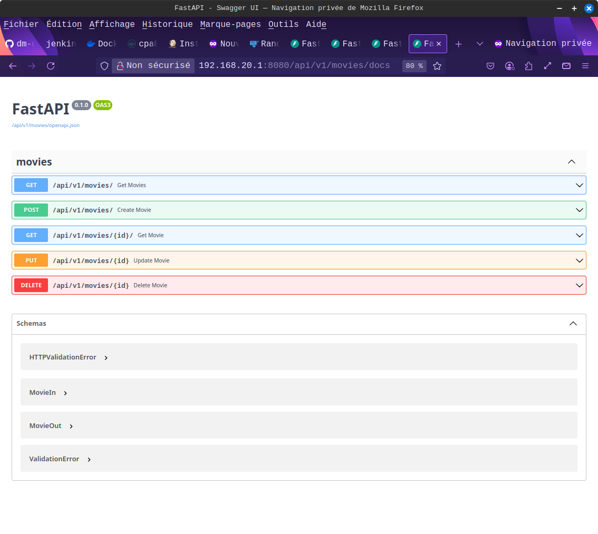
<br>


####S-9.3)  Test casts api from 192.168.20.1:8002
- Test curl 
```md
curl http://192.168.20.1:8002/api/v1/casts/docs 

    <!DOCTYPE html>
    <html>
    <head>
    <link type="text/css" rel="stylesheet" href="https://cdn.jsdelivr.net/npm/swagger-ui-dist@3/swagger-ui.css">
    <link rel="shortcut icon" href="https://fastapi.tiangolo.com/img/favicon.png">
    <title>FastAPI - Swagger UI</title>
    </head>
    <body>
    <div id="swagger-ui">
    </div>
    <script src="https://cdn.jsdelivr.net/npm/swagger-ui-dist@3/swagger-ui-bundle.js"></script>
    <!-- `SwaggerUIBundle` is now available on the page -->
    <script>
    const ui = SwaggerUIBundle({
        url: '/api/v1/casts/openapi.json',
    oauth2RedirectUrl: window.location.origin + '/docs/oauth2-redirect',
        dom_id: '#swagger-ui',
        presets: [
        SwaggerUIBundle.presets.apis,
        SwaggerUIBundle.SwaggerUIStandalonePreset
        ],
        layout: "BaseLayout",
        deepLinking: true
    })
    </script>
    </body>
    </html>
```
<br>

- Screenshot from firefox
http://192.168.20.1:8002/api/v1/casts/docs
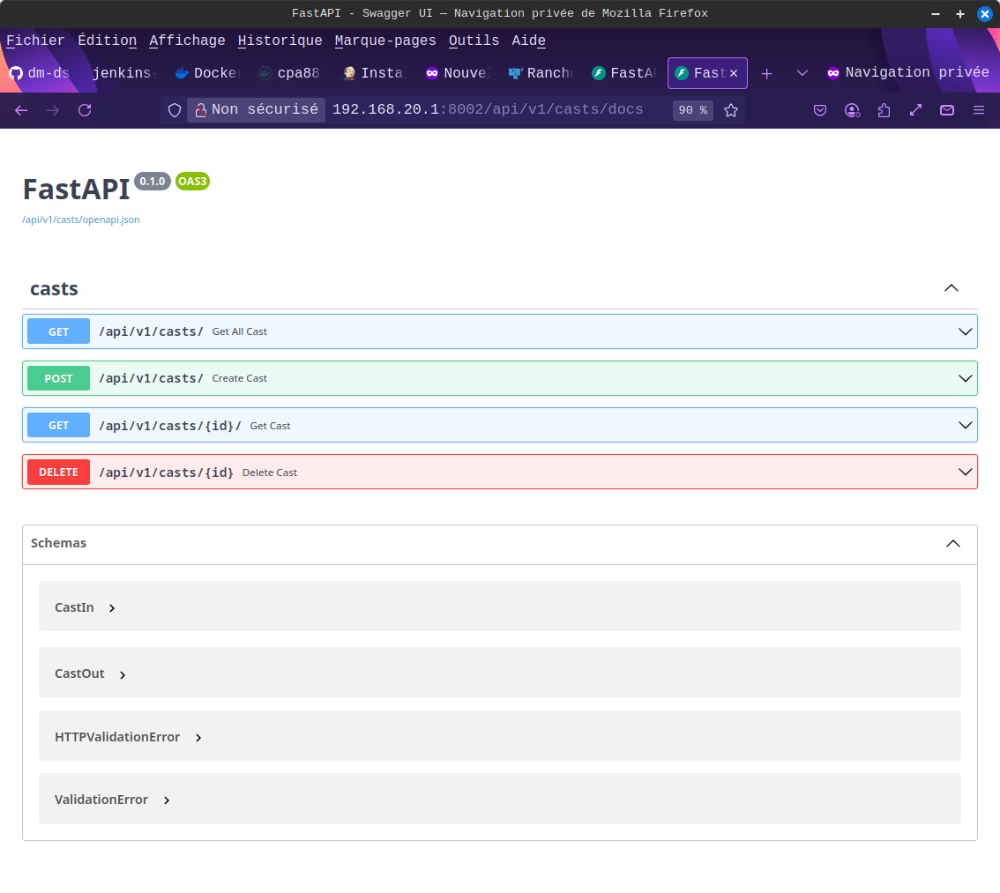 
<br>


### S-9.4)  Test casts api from 192.168.20.1:8080
- Test curl 
```md
curl http://192.168.20.1:8080/api/v1/casts/docs

    <!DOCTYPE html>
    <html>
    <head>
    <link type="text/css" rel="stylesheet" href="https://cdn.jsdelivr.net/npm/swagger-ui-dist@3/swagger-ui.css">
    <link rel="shortcut icon" href="https://fastapi.tiangolo.com/img/favicon.png">
    <title>FastAPI - Swagger UI</title>
    </head>
    <body>
    <div id="swagger-ui">
    </div>
    <script src="https://cdn.jsdelivr.net/npm/swagger-ui-dist@3/swagger-ui-bundle.js"></script>
    <!-- `SwaggerUIBundle` is now available on the page -->
    <script>
    const ui = SwaggerUIBundle({
        url: '/api/v1/casts/openapi.json',
    oauth2RedirectUrl: window.location.origin + '/docs/oauth2-redirect',
        dom_id: '#swagger-ui',
        presets: [
        SwaggerUIBundle.presets.apis,
        SwaggerUIBundle.SwaggerUIStandalonePreset
        ],
        layout: "BaseLayout",
        deepLinking: true
    })
    </script>
    </body>
```
<br>

- Screenshot from firefox
http://192.168.20.1:8080/api/v1/casts/docs 
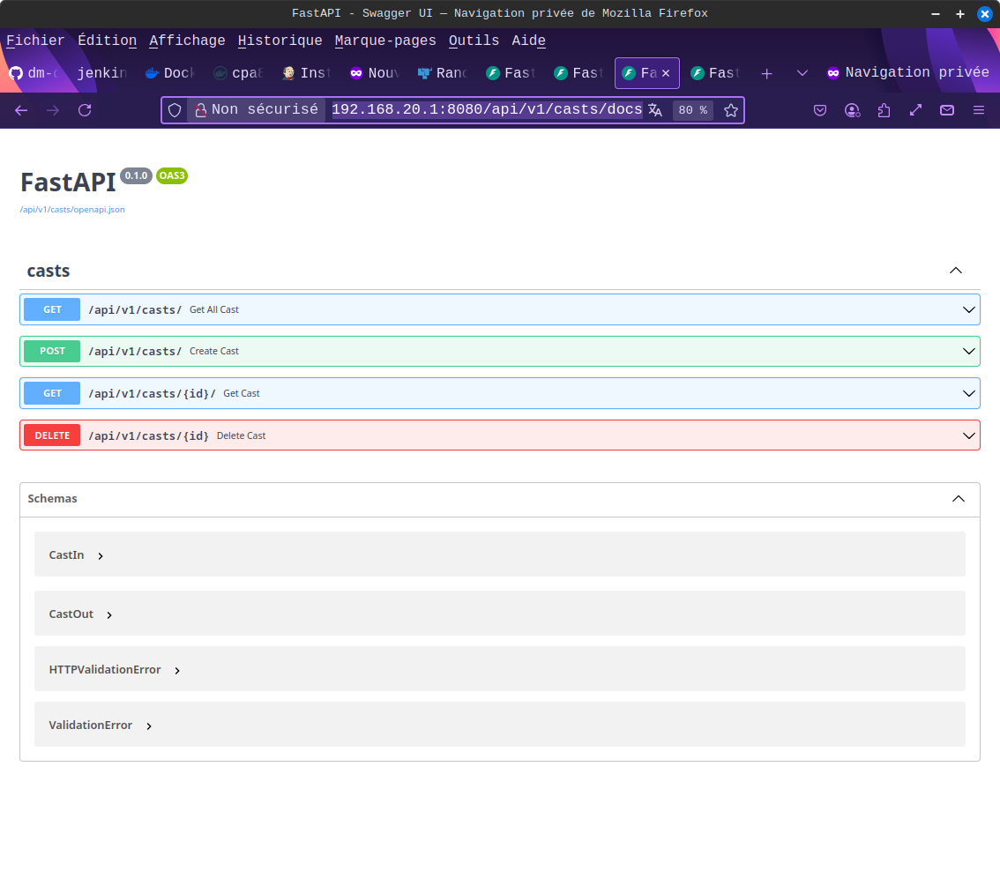
<br>
<br>
<br>
---
## Step 10)  Test charts helm fastapi applications 

Tests are realised  with file/home/cpa/Documents/CPA/44_JENKINS/DM.JENKINS/DM-SP04-C04-JENKINS-CPA-MAY2024/dm-ds-cdo-may24-jenkins/dr01-python-microservices6/charts/chart.yaml

### S-10.1)  Build the cluster k3d composed one ctl manager and 2 workers and a loadbalancer nginx 
```md
sudo k3d cluster create mycluster --network "dm-jenkins-cpa-infra_my-net" -p "8900:30080@agent:0" -p "8901:30081@agent:0" -p "8902:30082@agent:0" --agents 2 --k3s-arg "--tls-san=${ip_jenkins}"@server:*

sudo docker ps -a

sudo kubectl cluster-info

sudo kubectl get nodes
sudo kubectl get all -A -o wide


```
<br>

### S-10.2) Screenshot of the terminal after execute these commands on local PC
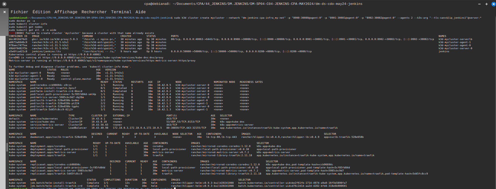
<br>

### S-10.4)  update ./enkinsfile
```md
    stage('Deploiement en staging'){
      environment {
        KUBECONFIG = credentials("config") // we retrieve  kubeconfig from secret file called config saved on jenkins
      }
      steps {
        script {
          sh '''
            rm -Rf .kube
            mkdir .kube
            ls
            cat $KUBECONFIG > .kube/config
            cp /fastapi/values-staging.yaml /fastapiapp/values.yaml
            cat /fastapiapp/values.yaml
            sed -i "s+tag.*+tag: ${DOCKER_TAG}+g" values.yml

            helm upgrade --kubeconfig /usr/local/k3s.yaml --install fastapi-staging /fastapiapp --namespace staging --create-namespace
          '''
          //kubectl --kubeconfig /usr/local/k3s.yaml delete namespace staging
        }
      }
```

### S-10.3) Script to verify execution on the jenkins server 
```md

```

<br>
<br>
<br>
---

## Step 11 : Configure jenkins to execute pipeline CI (S-11)
In this step, we configure Jenkins server to execute pipeline CI  

### S11-1) Install sugested plugins

### S-11-2) Create account administrator Jenkins server

###  S11-3) Save url of jenkins server : http://192.168.20.1:8280/ 

### S-11-4) Install others usefull plugins jenkins
1.  Github integration
2. Pipeline stage view
3. Email plugin
<br>
<br>
<br>
---

## Step 12)  Build and execute  pipeline CI  jenkins 

In this step, we create a Jenkinsfile and execute pipeline CI  

### S-12.1) Build : « ./Jenkinsfile » from /dr01-python-microservices6/
[Jenkinsfile](Jenkinsfile)
```md
```
<br>


### S-12.2) Screenshots after execute the pipeline with Jenkinsfile: « ./Jenkinsfile » from /dr01-python-microservices6/  
<br>
#### S-12.2.1) Stage view from Jenkinsfile
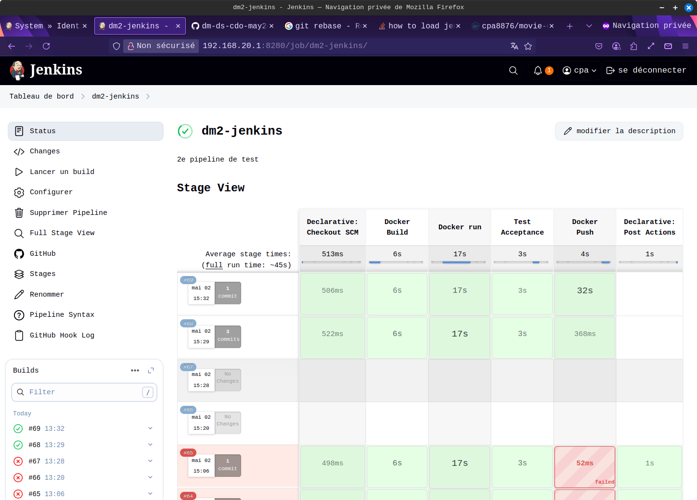
<br>
<br>
#### S-12.2.2)  Screenshot of the console output  
 Tableau de bord / dm2-jenkins #24 view from Jenkinsfile : console-output-test69-dm2-jenkins.png
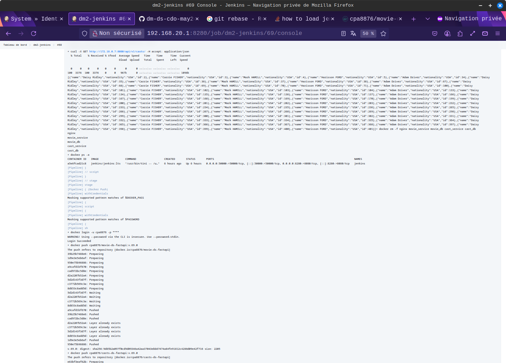
<br>

### S-12.3)  Terminal execution pipeline 69  
[log Test 69 Dm2 Jenkins](log/log-Test-69-Dm2-Jenkins.txt)


```md

```
---
<br>
<br>
<br>
---


